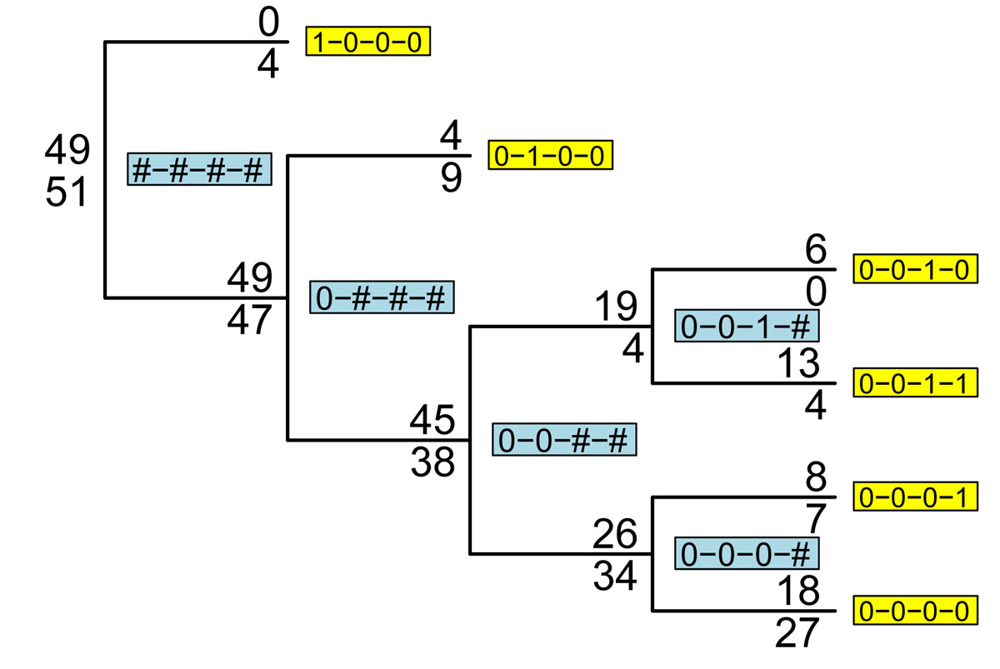

QTLTree
=======

This repository contains code for producing and permorming statistical tests using 
haplotype trees.

This is originally reported in 

[Finding genes that influence quantitative traits with tree-based clustering
Ian J Wilson, Richard AJ Howey, Darren T Houniet and Mauro Santibanez-Koref
BMC Proceedings 2011. 5(Suppl 9):S98](https://bmcproc.biomedcentral.com/articles/10.1186/1753-6561-5-S9-S98)
